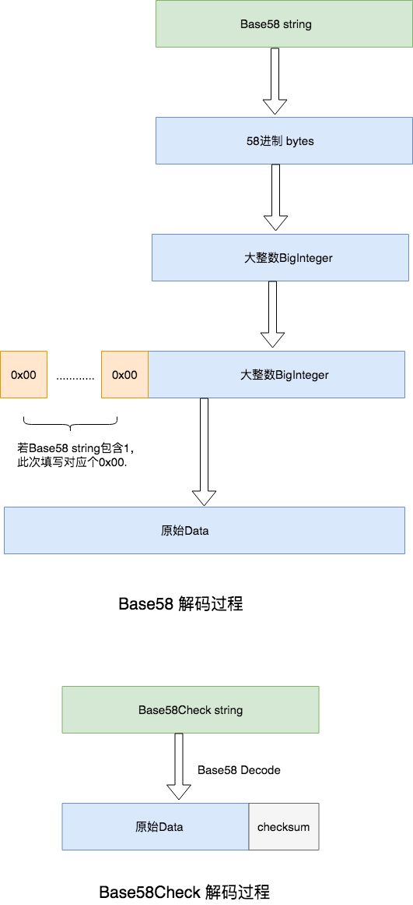
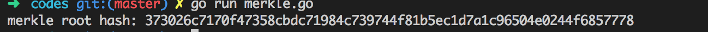
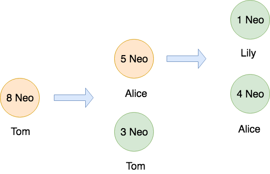

### homework 1


1. 画出Base58Check的解码过程流程图




2. 编码实现，梅克尔树根节点hash值计算。假设叶子节点为三笔交易，字节分为为: 0x0000, 0x1111, 0x2222

Go 代码实现

```go
package main

import (
	"crypto/sha256"
	"encoding/hex"
	"fmt"
)

func main() {
	txs := []string{"0000", "1111", "2222"}

	// 将16进制转为byte数组
	var txBytes [][]byte
	for _, tx := range txs {
		buf, err := hex.DecodeString(tx)
		if err != nil {
			fmt.Println(err)
			return
		}
		txBytes = append(txBytes, buf)
	}

	// 开始计算
	fmt.Printf("merkle root hash: %v\n", hex.EncodeToString(MerkleRootHash(txBytes...)))
}

func MerkleRootHash(leaves ...[]byte) []byte {
	if len(leaves) == 0 {
		return nil
	}
	//如果是基数节点数量，填上最后一个节点的值
	if len(leaves)%2 > 0 {
		leaves = append(leaves, leaves[len(leaves)-1])
	}

	var nodes [][]byte
	for i := range leaves {
		nodes = append(nodes, Hash(leaves[i]))
	}
	//递归计算
	return merkleHashHelper(nodes...)
}

func merkleHashHelper(nodes ...[]byte) []byte {
	if len(nodes) == 1 { //计算结束
		return nodes[0]
	}

	if len(nodes)%2 > 0 {
		nodes = append(nodes, nodes[len(nodes)-1])
	}

	var res [][]byte
	for i := 0; i < len(nodes); i += 2 {
		res = append(res, Hash(append(nodes[i], nodes[i+1]...)))
	}

	return merkleHashHelper(res...)
}

func Hash(data []byte) []byte {
	h := sha256.New()
	h.Write(data)
	bs := h.Sum(nil)
	return bs
}
```

运行结果：



3. 画图描述一笔UTXO的流通。Tom最开始有8个NEO，转账给Alice 5个Neo，Alice再将其中的1个NEO转给Lily，1个给了Tom。


