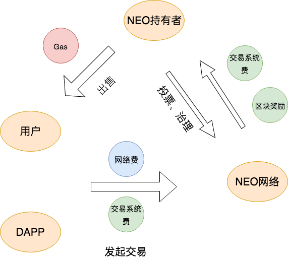
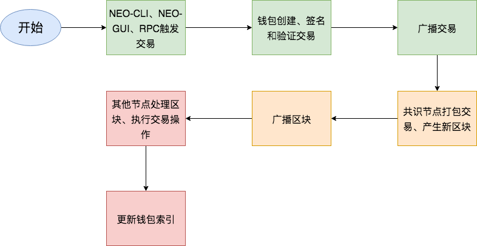

### homework 2

1. 画图描述NEO的经济模型

用户或DAPP发起交易时，需要支付一定数量的系统交易费和网络费（小费，可选）给NEO网络，NEO网络有共识节点和普通节点，共识节点参与区块交易的共识和打包，可以获得用户支付的网络费用。NEO持有者参与NEO网络的投票和治理从NEO网络中获得用户支付的系统费和区块奖励，NEO持有者可将得到的Gas出售给用户，由此形成一个闭环。

2. 尝试画一幅NEO的一笔交易的完整流程

