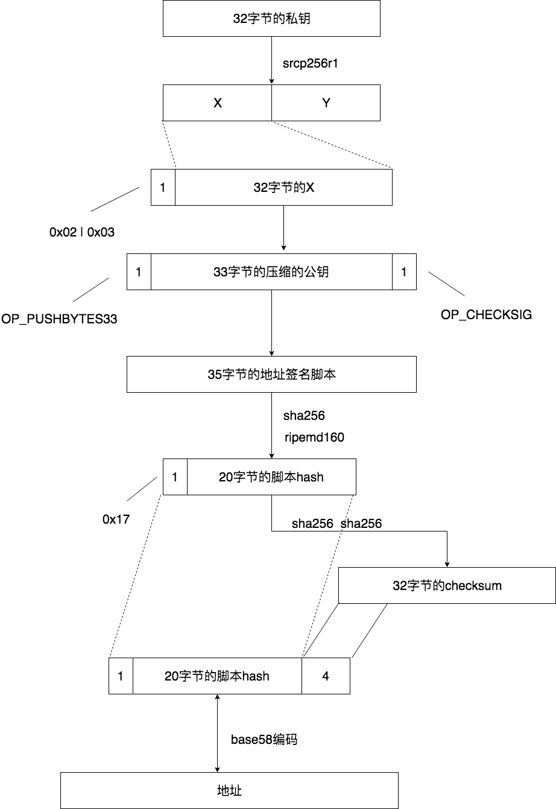

### homework 3

1. 尝试画一幅，私钥-> 公钥-> 脚本-> 地址 的转换图

2. 交易所会有大量的NEO账户地址，我们推荐交易所使用SQLite 还是NEP6 钱包？请说明理由

推荐交易所使用SQLite钱包，SQLite采用的加密算法是AES，NEP6钱包以scrypt为核心算法的加密方法。后者的计算比较消耗计算资源，而交易所的交易对实时性和系统的资源利用率要求较高，故推荐使用SQLite钱包。