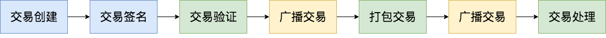
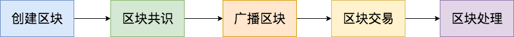

### homework 5

1. 描述交易的结构，生命周期

   | 字节数 | 字段       | 类型      | 描述                     |
   | ------ | ---------- | --------- | ------------------------ |
   | 1      | Type       | byte      | 交易类型                 |
   | 1      | Version    | byte      | 交易版本号，目前为0      |
   | ?      | -          | -         | 特定交易的数据           |
   | ?*?    | Attributes | tx_attr[] | 该交易所具备的额外特性   |
   | 34*?   | Inputs     | tx_in[]   | 输入                     |
   | 60 * ? | Outputs    | tx_out[]  | 输出                     |
   | ?*?    | Scripts    | Witness[] | 用于验证该交易的脚本列表 |

   

2. 描述区块的结构，与生命周期

| 字节数 | 字段          | 名称           | 类型          | 描述                                       |
| ------ | ------------- | -------------- | ------------- | ------------------------------------------ |
| 4      | Version       | 区块版本       | uint          | 区块版本号，目前为 `0`                     |
| 32     | PrevHash      | 上一个区块Hash | UInt256       | 上一个区块的hash值                         |
| 32     | MerkleRoot    | Merkle树       | Uint256       | 该区块中所有交易的Merkle树的根             |
| 4      | Timestamp     | 时间戳         | uint          | 该区块生成的大致时间                       |
| 4      | Index         | 区块高度       | uint          | 创世块的高度为0                            |
| 8      | ConsensusData | Nonce          | ulong         | 为共识过程需要预生成的一个随机数据         |
| 20     | NextConsensus | 下一个共识地址 | UInt160       | 下一个出块的共识节点的三分之二签名脚本hash |
| 1      | -             | -              | uint8         | 固定为 1                                   |
| ?      | Witness       | 见证人         | Witness       | 验证脚本的执行封装                         |
| 1      | -             | -              | uint8         | 固定为 0                                   |
| ?*?    | Transactions  | 交易列表       | Transaction[] | 区块的主数据                               |

3. 描述NEO是如何指定当前共识节点

从上一个区块中的NextConsensus字段指定本轮的共识节点。

3. 对比 UTXO类型的交易，与合约交易的优劣

UTXO模型

优：
  1. UTXO 模型是无状态的，更容易并发处理
  2. 节点只做验证即可，不需要对交易进行额外的计算，也没有额外的状态存储

劣：
  1. 当 Input 较多时，见证脚本也会增多。而签名本身是比较消耗 CPU 和存储空间的。
  2. 对于轻节点获取某一地址状态，UTXO 更复杂

Nep5代币模型

优：
  1. 可编程性高，容易理解
  2. 网络传输的量更小

劣：
  交易之间没有依赖性，需要解决重放问题

 