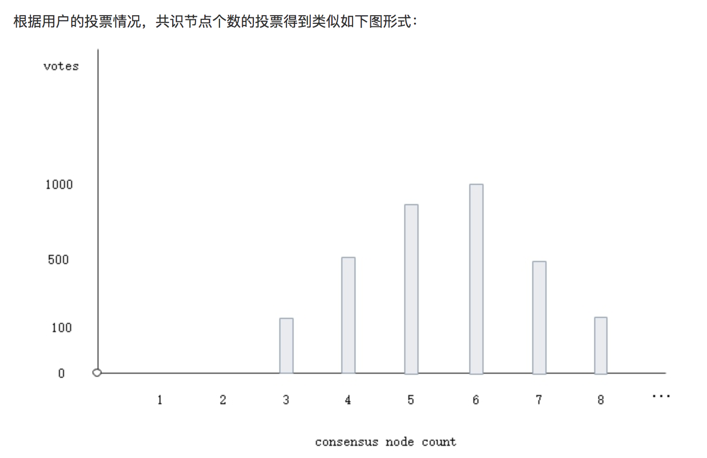
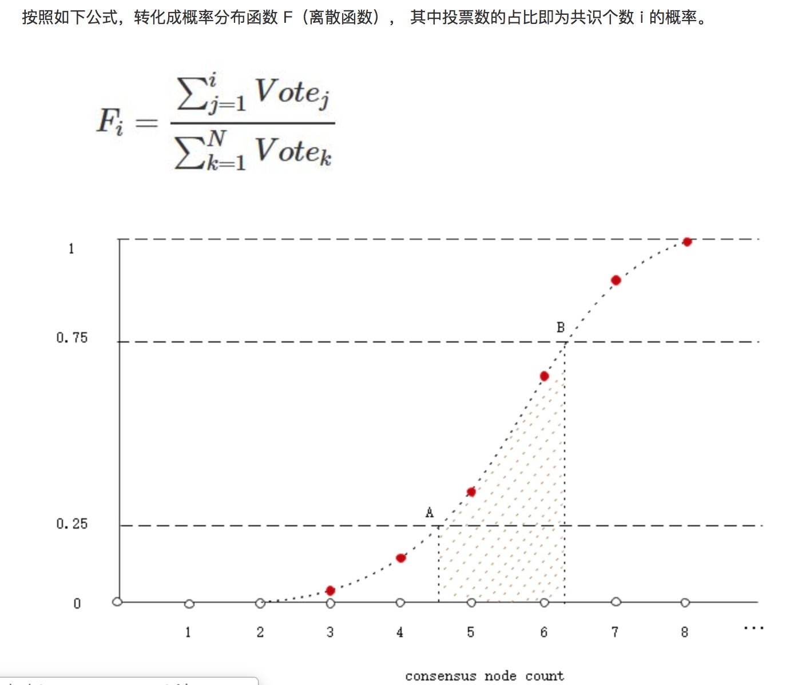
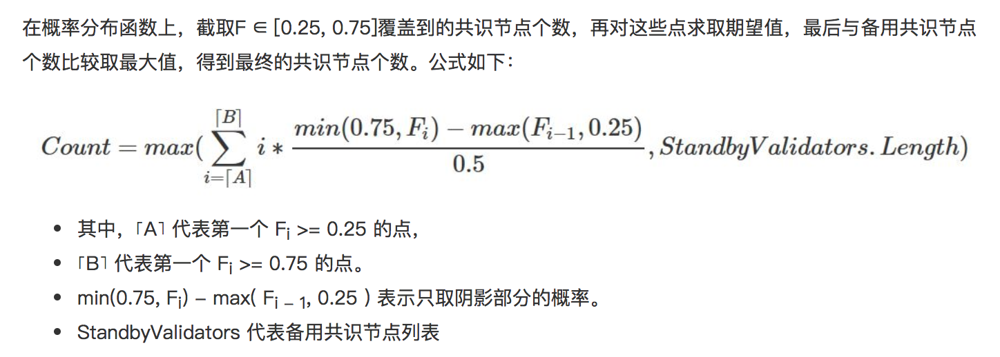

### homework 6

1. 描述NEO的共识过程，如何出新区块

  1. NEO持有者对节点进行投票
  2. 投票结果选举出指定个数的共识节点
  3. 对共识节点进行排序，排在最前面的就是议长，其他的就是议员
  4. 议长打包发起投票议案，广播议案
  5. 议员收到议案并对议案进行投票，并附上自己的签名
  6. 当共识节点收到超过三分之二时，出新块。

2. 描述NEO的投票规则，如何确定共识节点数，和具体的共识节点

投票规则：

可以通过两种特殊类型交易发起投票。一是，EnrollmentTransaction 直接申请成为验证人。二是，StateTransaction 进行投票或申请成为验证人。
投票内容包括共识节点的个数和被投票人的票数。

确定共识节点：

具体的共识节点：

在上面的步骤中，根据投票情况确定了共识节点个数Count，再根据申请验证人的投票进行降序排序，取前Count个。若申请的验证人不足时，则从备用共识节点进行补充

