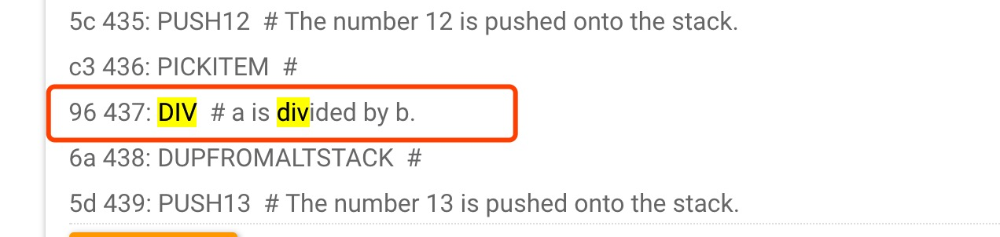

### homework 10 大作业


2. 将合约 Calculator.cs 部署在私链上。合约编译：

   [avm文件 calculator.avm和calculator.abi.json](calculator.avm)

3. 尝试从合约代码的AVM Opcode指令集中，定位出 `div`逻辑的代码段。（请使用 https://neocompiler.io/#!/ecolab/compilers 编译后的Opcode指令集）

