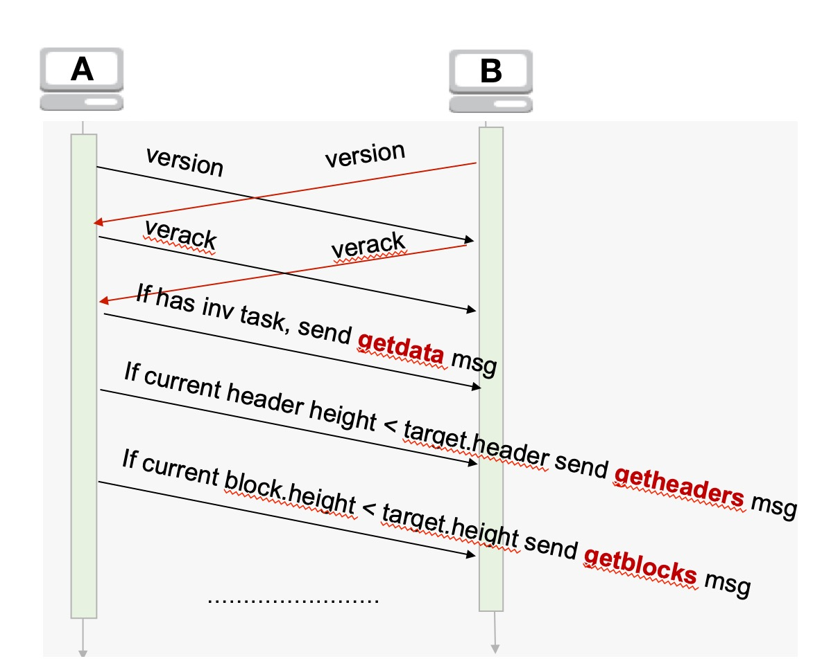

### homework 4

##### 描述节点之间的握手协议

握手协议发生在两个节点连接成功后，进行互相确认。确认成功后，再进行消息的互相通讯和数据同步。
假设新连接成功的两个节点分别为A和B，确认过程如下：

1.A，B节点 ***互相*** 发送Version消息。Version消息包含自己节点的时间装，当前区块高度和消息版本号等内容，让对方进行确认。如果确认不通过，则直接断开连接。确认通过后进入第二步。

2.A和B节点验证过对方的Version消息后，就向对方回复个Verack消息，双方都收到对方的Verack消息后，表示握手成功。双方建立了互信的消息通道，就可以互相通讯了.

3.如果这时一方收到对方Inv消息，则向对方发送getdata消息，对方将需要同步的交易或区块hash传送过来.

4.如果没有Inv消息，对根据自己的区块头和Version发送来的区块头做比较，如果自己的区块头小于对方的区块头，则根据自己的节点类型，向对方发送getheaders或getblocks消息，对方则将相应的数据返回，以达到同步数据的目的.

