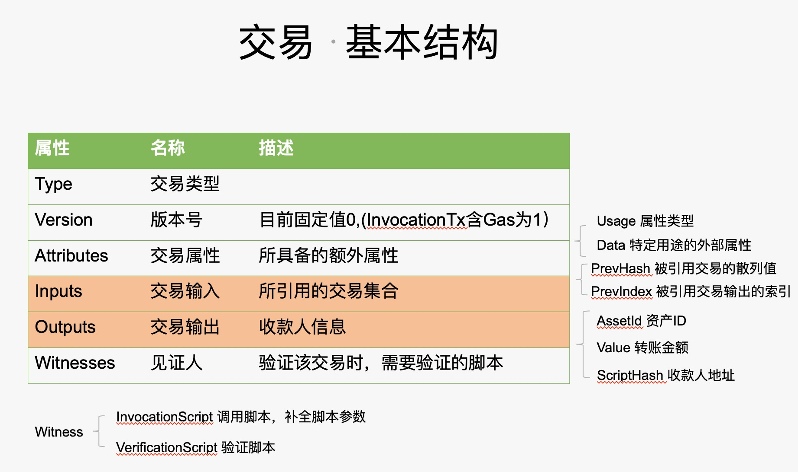

###一.交易数据结构

```C#
public abstract class Transaction : IEquatable<Transaction>, IInventory, IVerifiable, ISerializable, IScriptContainer, IInteropInterface
{
	private const int MaxTransactionAttributes = 16;

	private static ReflectionCache<byte> ReflectionCache = ReflectionCache<byte>.CreateFromEnum<TransactionType> ();

	public readonly TransactionType Type;  //交易类型

	public byte Version; //交易的版本号

	public TransactionAttribute[] Attributes;//所具备的额外属性

	public CoinReference[] Inputs;//所引用的交易集合

	public TransactionOutput[] Outputs;//收款人信息

   public Witness[] Scripts { //见证人,验证该交易时，需要验证的脚本
		get;
		set;
	}
	~~~省略代码
```

###二.Attributes数据结构
```C#
public class TransactionAttribute : IInteropInterface, ISerializable
{
	public TransactionAttributeUsage Usage;//属性类型

	public byte[] Data;//特定用途的外部属性

	~~~代码省略
}

```

###三.Inputs的数据结构 
```C#
public class CoinReference : IEquatable<CoinReference>, IInteropInterface, ISerializable
{
	public UInt256 PrevHash;//被引用交易的散列值

	public ushort PrevIndex;//被引用交易输出的索引
    ~~~代码省略
}
```
###四。Outputs的数据结构
```C#
public class TransactionOutput : IInteropInterface, ISerializable
{
	public UInt256 AssetId;//资产ID

	public Fixed8 Value;//转账金额
	
	public UInt160 ScriptHash;//收款人地址
	
    ~~~代码省略
}
```
###五。交易类型Type的值
```C#
public enum TransactionType : byte
{
	[ReflectionCache (typeof(MinerTransaction))]
	MinerTransaction = 0,
	[ReflectionCache (typeof(IssueTransaction))]
	IssueTransaction = 1,
	[ReflectionCache (typeof(ClaimTransaction))]
	ClaimTransaction = 2,
	[ReflectionCache (typeof(EnrollmentTransaction))]
	EnrollmentTransaction = 0x20,
	[ReflectionCache (typeof(RegisterTransaction))]
	RegisterTransaction = 0x40,
	[ReflectionCache (typeof(ContractTransaction))]
	ContractTransaction = 0x80,
	[ReflectionCache (typeof(StateTransaction))]
	StateTransaction = 144,
	[ReflectionCache (typeof(PublishTransaction))]
	PublishTransaction = 208,
	[ReflectionCache (typeof(InvocationTransaction))]
	InvocationTransaction = 209
}

```
###六。Witness见证人数据结构
```C#
public class Witness : ISerializable
{
	public byte[] InvocationScript;//调用脚本，补全脚本参数 

	public byte[] VerificationScript;// 验证脚本

	private UInt160 _scriptHash;

}
```
见证人就是解锁Inputs所使用的脚本。有几个inputs就有几个见证人。他们是一一对应的.





---
###交易生命周期 

一个交易的生命周期就是从创建到被执行的过程,过程如下：

**1,创建**

  此步主要工作是构造交易的输入和输出和手续费及找零的构造，也就是构造交易输入和交易输出的过程.

**2.签名**

此步主要工作是就是利用私钥将构造的交易进行签名，得到被签名的数据后，进行下一步。

**3.广播**

此步就是将签名后的交易数据广播到区块链的网络中，等待被共识节点打包到区块中。

**4.验证交易**

区块链网络中的节点收到此交易后，会进行交易有效性的验证，防止双花，验证内容包括**合法性校验和验证人校验:**

合法性校验包括：

交易输入不重复、
交易输入不能是已经花费的、
资产不能是过期资产、
Inputs金额与output金额必须对应、
资产类型与金额必须匹配、
输入金额必须有包含足够的手续费。

验证人校验包括：

Input对应的output的收款人地址脚本，即解锁UTXO、Output涉及特殊资产AssetType.DutyFlag(Share类资产)， 必须包含收款人地址脚本、Attributes涉及到Script属性的脚本。

验证通过后会放入自己的交易池，并再次广播出去，让其他节点同步并验证。

**5.被共识节点打包到区块**

当某个共识节点轮值的时候，会从交易池拿出交易，并按照一定的规则进行交易过滤和排序，然后放大区块的交易列表中，这样就完成了区块体的构造。共识完成后，再将此区块广播出去，让其他节点进行有效性验证.

**6.验证区块**

网络中的节点收到区块后，会进行区块的校验，包括：**合法性验证和见证人校验.**

合法性校验包括：

检查上一个区块是否存在、检查上一个区块高度，是否等于当前区块高度-1､检查上一个区块时间戳，是否小于当前区块时间戳。

见证人校验包括：

见证人脚本为上一区块的NextConsensus字段，即多方签名脚本

**7.广播区块**

区块验证通过后，会将区块进行广播，让其他节点进行验证,并同步区块数据


**8.全节点收到区块后，存储区块并执行交易**

节点收到新块后，会遍历区块里的所有交易，并根据交易类型，进行不同的处理。最后更新各自节点的账本.


**9.如果轻节点同步到此区块，更新钱包余额和索引**

以上就是交易的生命周期。


