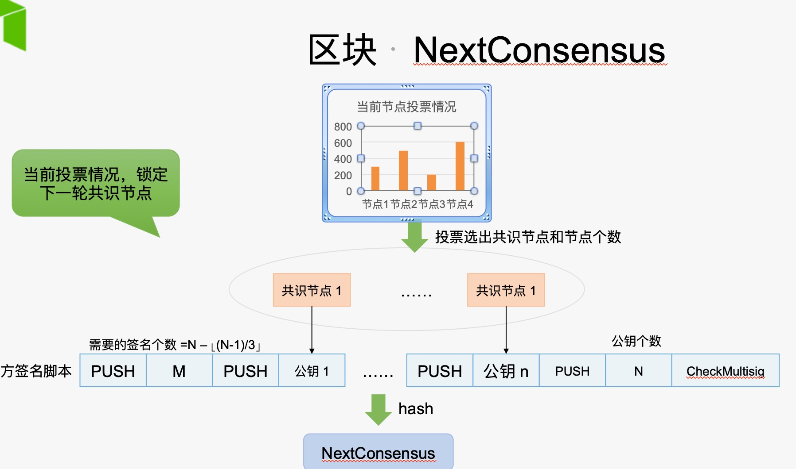

#共识节点的指定：

####1.首先发送申请成为共识节点的交易。

####2.大家可以投票给这些申请节点，最后选出共识节点和节点个数

####3.当前议长在创建区块的时候，会拿到当前投票的结果，也就是选出的共识节点。也就是这些节点的公钥

####4.议长根据拿到这些公钥后，会组织成多签脚本，也可以理解为多签合约

####5.调用hash160 (Sha256().RIPEMD160()) 编码为一个20字节的哈希值。此哈希值就是NextConsensus。

####6.这些节点选出来并指定在了区块中，但要生效需要在下个区块中生效。所以这区块中的字段名为：NextConsensus（下轮共识节点）。

---

#UTXO交易和合约交易

Neo有两种余额模型:

UTXO模型和余额模型。
UTXO模型用于全局资产的转账，如（neo,gas)
余额模型用于合约资产（nep5资产）的转账.

nep5资产的转账是需要通过utxo账户发送交易来触发合约的执行进行转账的。这样既结合了utxo的链式结构，又可以实时拿到某个合约账户的余额。

Nep5的余额模型采用的合约的Storage内部存储采用key-value形式进行存储。