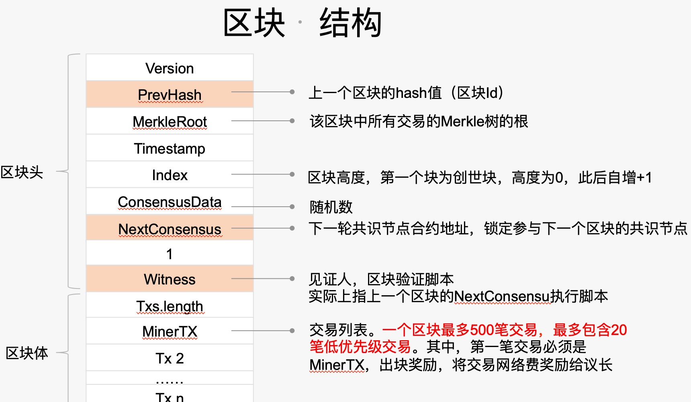

###一.区块的数据结构
```C#
public class Block : BlockBase, IInventory, IVerifiable, ISerializable, IScriptContainer, IInteropInterface, IEquatable<Block>
{
	public Transaction[] Transactions;//交易列表。一个区块最多500笔交易，最多包含20笔低优先级交易。其中，第一笔交易必须是MinerTX，出块奖励，将交易网络费奖励给议长

	private Header _header;//区块头
	~~~代码省略
}
	
```

区块的数据结构包含区块头和交易列表(也叫区块体）,交易数据结构前面有介绍。
我们来看区块头的数据结构

###二。区块头的数据结构
```C#
public abstract class BlockBase : IVerifiable, ISerializable, IScriptContainer, IInteropInterface
{
	public uint Version; //版本号

	public UInt256 PrevHash;//上一个区块的hash值（区块Id

	public UInt256 MerkleRoot;//该区块中所有交易的Merkle树的根

	public uint Timestamp;//区块的时间戳

	public uint Index;//区块高度，第一个块为创世块，高度为0，此后自增+1

	public ulong ConsensusData;//随机数

	public UInt160 NextConsensus;//下一轮共识节点合约地址，锁定参与下一个区块的共识节点

	public Witness Script;//见证人，区块验证脚本 实际上指上一个区块的NextConsensu执行脚本
	~~~代码省略
```



---

###区块生命周期 

其实理解了交易的生命周期，基本上就了解了区块的生命周期，就是交易的生命周期中从交易被打包到区块中开始，就进入了区块的生命周期。

不过我们也再详细说五这个过程：

####一.创建

区块的创建在Neo中分了三步，也就是共识过程:

1.议长先创建个提案块让其他议员节点进行验证。这个步骤就会根据当前对议员的投票进行下一轮共识节点的构造即NextConsensus

2.超过2/3的节点同意此提案块，则构造成完整的区块。

3.每个共识节点签名该区块。以达到多签的目的。

####二.广播

区块创建成功后，就要广播到网络中让其他节点进行验证和存储。

####三.节点校验

节点收到区块后，就要进行有效性校验。验证内容包括：**合法性验证和见证人校验.**

1.合法性校验包括：

检查上一个区块是否存在、检查上一个区块高度，是否等于当前区块高度-1､检查上一个区块时间戳，是否小于当前区块时间戳。

2.见证人校验包括：

见证人脚本为上一区块的NextConsensus字段，即多方签名脚本

####四.广播

区块验证通过后，会将区块进行广播，让其他节点进行验证,并同步区块数据

####五.区块处理

每个节点收到区块后，会遍历区块体执行交易并将区块和交易存储在节点上。这样每个节点存储一份数据，以达到不可篡改的目的。

