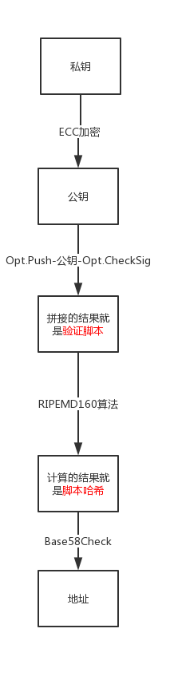

## homework 3

### 1. 尝试画一幅，私钥-> 公钥-> 脚本-> 地址 的转换图

详情见图 transform.jpg

---

### 2. 交易所会有大量的NEO账户地址，我们推荐交易所使用SQLite 还是NEP6 钱包？请说明理由

推荐使用 NEP6 json 格式的钱包

原因：

1. json 可跨平台，兼容性强
1. 使用 NEP2 加解密，安全有保障
1. json 数据人眼可读，可方便获取钱包的多个信息