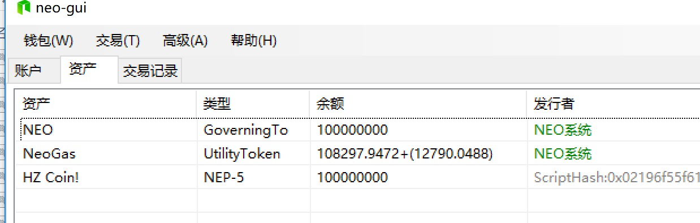
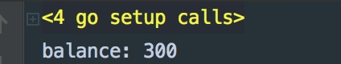

# Homework

## HW1

Finish Domain Smart Contract

```csharp
private static bool Delete(string domain)
{
    byte[] value = Storage.Get(Storage.CurrentContext, domain);
    if (value == null) return false;

    byte[] caller = ExecutionEngine.CallingScriptHash;
    if (!Equals(value, caller)) return false;

    Storage.Delete(Storage.CurrentContext, domain);
    return true;
}

private static bool Equals(byte[] b1, byte[] b2)
{
    if (b1.Length != b2.Length) return false;
    if (b1 == null || b2 == null) return false;
    for (int i = 0; i < b1.Length; i++)
         if (b1[i] != b2[i])  return false;
    return true;
}
```

## HW2

Create a new NEP5 Smart Contract

[Code](./HZC.cs)



## HW3

Query NNC balance of ATgjfbkkgAgpfGe1DiKjLwvGSXZ7MMUjZU

Go Code
```go
package main

import (
	"fmt"
	"github.com/hzxiao/goutil"
	"github.com/hzxiao/goutil/httputil"
)

var seed = "http://seed2.aphelion-neo.com:10332"
var nnc = "fc732edee1efdf968c23c20a9628eaa5a6ccb934"

func main()  {
	reqArgs := goutil.Map{
		"id": 1,
		"jsonrpc": "2.0",
		"method": "getnep5balances",
		"params": []interface{}{"ATgjfbkkgAgpfGe1DiKjLwvGSXZ7MMUjZU"},
	}

	var res goutil.Map
	err := httputil.PostJSON(seed, reqArgs, httputil.ReturnJSON, &res)
	if err != nil {
		fmt.Println(err)
		return
	}

	for _, b := range res.GetMapArrayP("result/balance") {
		if b.GetString("asset_hash") == nnc {
			fmt.Printf("balance: %v\n", b.GetInt64("amount"))
		}
	}
}
```

Ruselt

